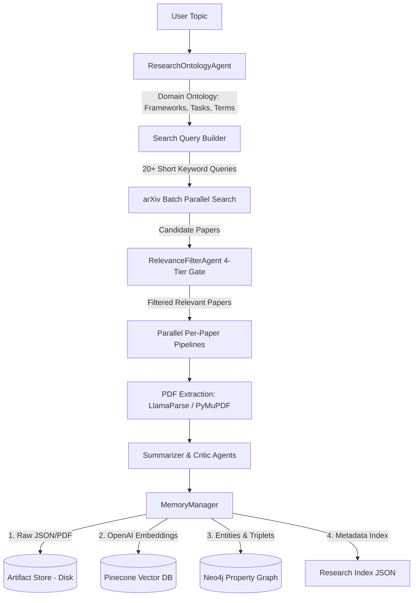
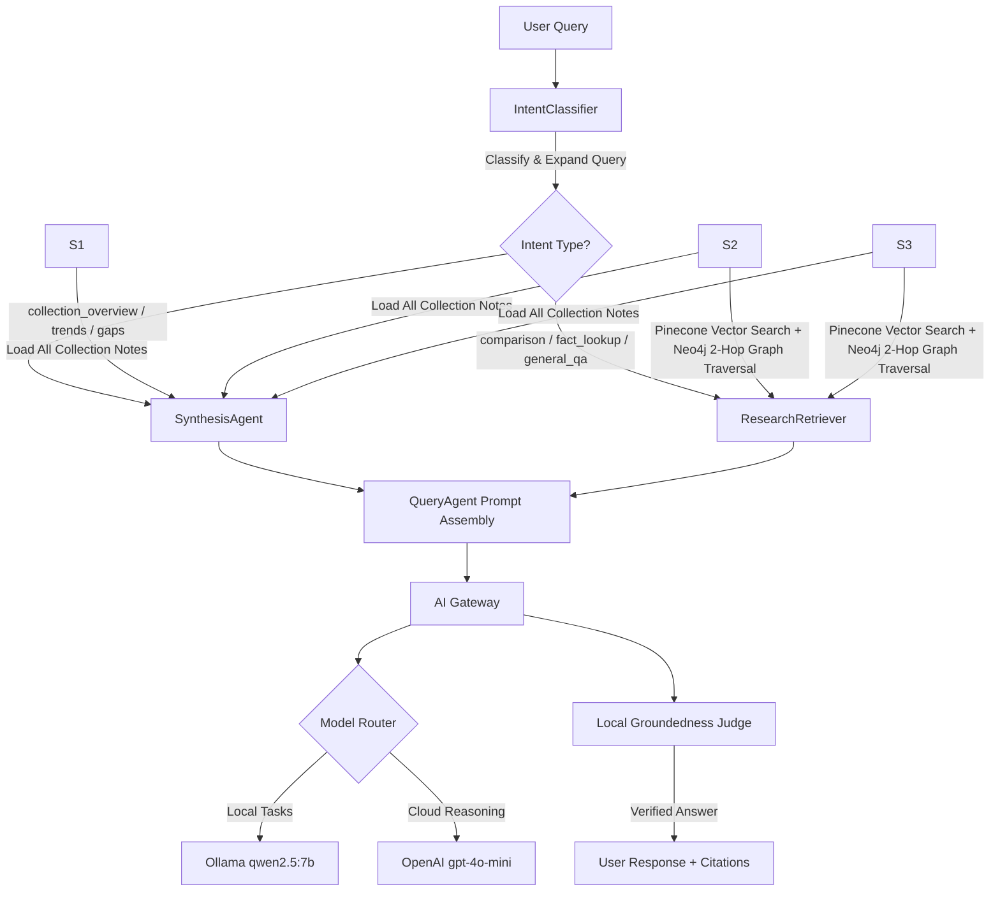

<p align="center">
  
</p>

# Helix Research 🧬

<p align="center">
  <b>Enterprise-Grade Autonomous Multi-Agent Research Platform & GraphRAG Memory System.</b>
</p>

<p align="center">
  <a href="https://github.com/langchain-ai/langgraph"></a>
  <a href="https://pinecone.io"></a>
  <a href="https://neo4j.com"></a>
  <a href="https://ollama.com"></a>
  <a href="https://openai.com"></a>
</p>

Helix Research is a production-grade AI research engineering platform. When given a complex research topic, it autonomously constructs a domain ontology, builds targeted keyword queries, retrieves academic literature, filters out noise pre-download via a 4-tier LLM relevance gate, parallelizes paper digestion, and establishes a session-scoped 4-layer memory (Disk, Pinecone, Neo4j, Index). 

Users can ask collection-wide synthesis questions (*"What are these papers about?"*, *"What research gaps exist?"*) or targeted questions (*"Compare Episodic vs Working Memory"*), receiving intent-aware, hallucination-checked responses.

---

## 🌟 Key Upgrades & Architecture Highlights

<table>
  <tr>
    <td width="30%"><b>Research Ontology Decomposer</b></td>
    <td>Moves away from naive long-sentence LLM queries. The <code>ResearchOntologyAgent</code> analyzes the domain vocabulary (core concepts, named frameworks like <i>MemGPT</i>/<i>MemoryOS</i>, task types, datasets, and negative terms). A pure Python <code>SearchQueryBuilder</code> transforms this into 20+ short, targeted, arXiv-optimized queries with auto-retry fallback chains.</td>
  </tr>
  <tr>
    <td><b>4-Tier Relevance Filter</b></td>
    <td>Candidates are graded into <code>highly_relevant</code>, <code>relevant</code>, <code>weakly_relevant</code>, and <code>irrelevant</code> before downloading. Papers matching domain negative terms (e.g. OS memory management) are automatically discarded pre-ingestion.</td>
  </tr>
  <tr>
    <td><b>Intent Classifier & Synthesis Agent</b></td>
    <td>Queries are classified into 7 intent types (e.g. <code>collection_overview</code>, <code>trend_analysis</code>, <code>gap_analysis</code>, <code>comparison</code>, <code>fact_lookup</code>). Collection-level questions bypass vector similarity and load the full collection into a <code>SynthesisAgent</code> that maps research directions, paper relationships, and research gaps.</td>
  </tr>
  <tr>
    <td><b>4-Layer Memory System</b></td>
    <td>
      1. <b>Artifact Store (Disk):</b> Source of truth storing raw PDFs and JSON metadata.<br>
      2. <b>Pinecone Vector DB:</b> Cloud-hosted semantic index powered by OpenAI <code>text-embedding-3-small</code> embeddings.<br>
      3. <b>Neo4j Property Graph:</b> Entity-relationship triplets (<code>Method</code>, <code>Dataset</code>, <code>Metric</code>, <code>Concept</code>).<br>
      4. <b>Research Index:</b> Global session tracking and deduplication.
    </td>
  </tr>
  <tr>
    <td><b>AI Gateway Control Tower</b></td>
    <td>Centralized LLM gateway featuring semantic caching, token & cost tracking, task-to-model routing (Ollama local for fast filtering/classification, OpenAI for reasoning), automatic fallback switching, and a local LLM Groundedness Judge to verify responses against hallucinations.</td>
  </tr>
</table>

---

## 📐 System Architecture

### 1. Ingestion Pipeline (The Write Path)



### 2. Query & RAG Pipeline (The Read Path)



---

## 📂 Project Structure

```
Helix_Research/
├── app.py                      # Streamlit dashboard interface
├── chat.py                     # Session-scoped interactive CLI UI
├── monitor.py                  # Background monitor daemon for new papers
├── requirements.txt            # Python dependencies
├── .env                        # Environment configuration
│
├── src/
│   ├── agents/
│   │   ├── research_ontology_agent.py # Domain ontology generator
│   │   ├── decomposer.py             # Orchestrates ontology -> query builder
│   │   ├── relevance_filter.py       # 4-tier pre-download paper classifier
│   │   ├── pdf_extractor.py          # PDF layout & text extraction
│   │   ├── summarizer.py             # Structured outline summary generator
│   │   ├── critic_note.py            # Senior-engineer Knowledge Note creator
│   │   ├── extractor_agent.py        # Graph entity-relationship triplet extractor
│   │   ├── memory_manager.py         # 4-layer memory orchestrator
│   │   ├── intent_classifier.py      # 7-class intent detection & query expansion
│   │   ├── synthesis_agent.py        # Cross-paper collection synthesis agent
│   │   ├── query_agent.py            # Intent-routed RAG answering logic
│   │   ├── session_manager.py        # Workspace session manager
│   │   └── monitor_agent.py          # Background polling agent
│   │
│   ├── tools/
│   │   ├── query_builder.py          # Deterministic arXiv query builder + retry
│   │   ├── arxiv_tool.py             # Rate-limited arXiv API client
│   │   ├── pdf_tools.py              # PyMuPDF / LlamaParse integration
│   │   ├── retriever.py              # Vector + threshold retrieval helper
│   │   └── research_index.py         # Global tracking & deduplication
│   │
│   ├── gateway/
│   │   ├── gateway.py                # AI Gateway control tower
│   │   ├── model_registry.py         # Task-to-model routing matrix
│   │   ├── embeddings.py             # Embedding gateway (OpenAI/Ollama)
│   │   ├── router.py                 # Provider routing & fallback switching
│   │   ├── cache.py                  # Gateway JSON response cache
│   │   └── cost_tracker.py           # Token & USD cost tracking
│   │
│   ├── db/
│   │   ├── pinecone_client.py        # Cloud Pinecone vector DB client
│   │   ├── chroma_client.py          # Legacy Chroma DB client
│   │   └── neo4j_client.py           # Property Graph DB client
│   │
│   ├── storage/
│   │   └── artifact_store.py         # Disk file storage (papers/{arxiv_id}/)
│   │
│   ├── graphs/
│   │   ├── ingestion_graph.py        # LangGraph ingestion pipeline
│   │   └── query_graph.py            # LangGraph query pipeline
│   │
│   ├── models/
│   │   ├── schemas.py                # Pydantic state & data schemas
│   │   └── session.py                # Session configuration schemas
│   │
│   └── config.py                     # Pydantic central settings
│
├── debug/
│   ├── test_ingestion_phases.py      # Step-by-step 7-phase pipeline inspector
│   ├── test_ontology.py              # Ontology + Query Builder validator
│   └── test_rag_overhaul.py          # E2E validation test suite
│
└── papers/                           # Source of truth disk storage
```

---

## ⚡ Quick Start & Setup

### 1. Prerequisites
* **Python**: `3.11` or higher.
* **Ollama**: Local instance with `qwen2.5:7b` pulled:
  ```bash
  ollama pull qwen2.5:7b
  ```
* **Pinecone**: Free account at [pinecone.io](https://pinecone.io).
* **Neo4j**: Local instance running at `bolt://localhost:7687` (optional, for Knowledge Graph).

### 2. Installation
```bash
# Clone the repository
cd Research_Agent

# Create and activate virtual environment
python -m venv .venv
.venv\Scripts\activate   # Windows
# source .venv/bin/activate # Linux/macOS

# Install dependencies
pip install -r requirements.txt
```

### 3. Environment Configuration
Create or edit your `.env` file:
```env
# LLM / Gateway
OLLAMA_BASE_URL=http://localhost:11434
DEFAULT_MODEL=qwen2.5:7b
EXTRACTION_MODEL=qwen2.5:7b
CRITIC_MODEL=qwen2.5:7b
OPENAI_API_KEY=sk-proj-xxxxxxxxxxxxxxxx

# LlamaParse
LLAMA_CLOUD_API_KEY=llx-xxxxxxxxxxxxxxxx

# Pinecone Vector DB
PINECONE_API_KEY=pc-xxxxxxxxxxxxxxxx
PINECONE_INDEX_NAME=helix-research
PINECONE_CLOUD=aws
PINECONE_REGION=us-east-1
PINECONE_EMBEDDING_DIM=1536

# Neo4j Property Graph
NEO4J_URI=bolt://localhost:7687
NEO4J_USER=neo4j
NEO4J_PASSWORD=your_password

# LangSmith Tracing
LANGCHAIN_TRACING_V2=true
LANGCHAIN_API_KEY=lsv2_pt_xxxxxxxx
LANGCHAIN_PROJECT=helix-research
```

---

## 🧪 Verification & Testing

Inspect the pipeline phases or run full validation tests:

```powershell
# 1. Test Ontology Generation & Query Builder
python debug/test_ontology.py

# 2. Inspect all 7 Ingestion Phases step-by-step
python debug/test_ingestion_phases.py "memory architectures in AI agents"

# 3. Run full E2E RAG Validation Suite
python debug/test_rag_overhaul.py
```

---

## 💻 Usage

### Interactive CLI Chat
```powershell
# Start topic session
python chat.py --topic "memory architectures in AI agents"
```

### Streamlit Dashboard
```powershell
streamlit run app.py
```

### Background Monitor Daemon
```powershell
python monitor.py
```

---

## 🛡️ License

MIT License. Designed and built for enterprise-grade autonomous AI research workflows.
