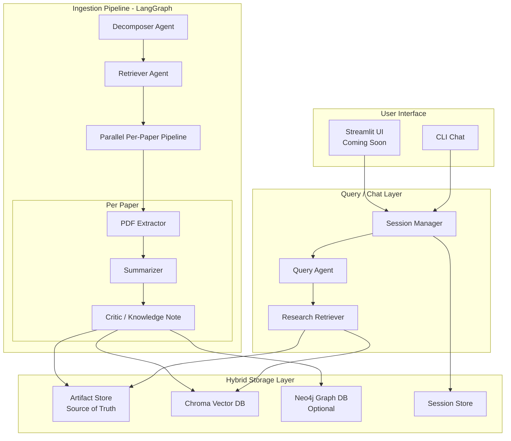
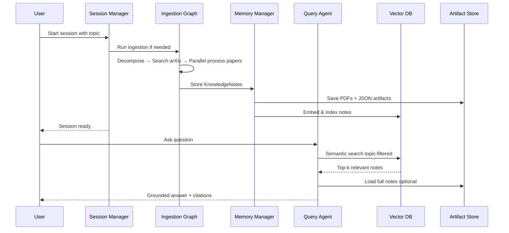
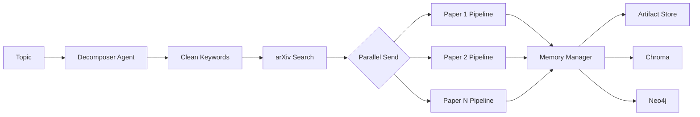

# Agentic Research Memory System

> **Autonomous multi-agent system that turns research topics into a living, queryable knowledge base.**

[](https://www.python.org/downloads/)
[](https://github.com/langchain-ai/langgraph)

---

## Overview

This project is a **production-style Agentic Research Assistant** built with LangGraph.  

You give it a research topic.  
It autonomously:

1. Decomposes the topic into high-quality search queries  
2. Retrieves relevant papers from arXiv  
3. Processes every paper in **parallel** (PDF extraction → structured summary → senior-engineer knowledge notes)  
4. Stores everything in a hybrid memory (files + vector DB + optional graph)  
5. Lets you **talk** to the resulting knowledge base through session-scoped chat

It is designed as a real research engineer’s second brain.

---

## Architecture



### High-Level Data Flow



---

## Key Features

| Feature                        | Description                                                                 | Status      |
|--------------------------------|-----------------------------------------------------------------------------|-------------|
| **Topic-scoped Sessions**      | Every chat is tied to a research topic. History & papers stay isolated.    | ✅ Done     |
| **Autonomous Ingestion**       | Decomposer + arXiv search + parallel paper processing                      | ✅ Done     |
| **Senior-Engineer Notes**      | Structured summaries with objectives, contributions, benchmarks, limitations | ✅ Done     |
| **Hybrid Memory**              | File-based Artifact Store + Chroma + Neo4j                                 | ✅ Done     |
| **Grounded Chat**              | RAG with proper arXiv citations and source scores                          | ✅ Done     |
| **Parallel Processing**        | LangGraph `Send()` for true multi-paper concurrency                        | ✅ Done     |
| **Rate-limit Friendly**        | Polite arXiv client with retries and delays                                | ✅ Done     |
| Continuous Monitor             | Background agent for new papers                                            | 🔜 Planned  |
| Streamlit Dashboard            | Beautiful web UI                                                           | 🔜 Planned  |
| GraphRAG                       | Full Neo4j reasoning over authors, concepts, citations                     | 🔜 Planned  |

---

## Project Structure

```
Research_Agent/
├── chat.py                      # Main CLI entrypoint (session-aware)
├── test_full_system.py          # End-to-end test
├── pyproject.toml
├── .env
├── README.md
│
├── src/
│   ├── agents/
│   │   ├── decomposer.py
│   │   ├── pdf_extractor.py
│   │   ├── summarizer.py
│   │   ├── critic_note.py
│   │   ├── memory_manager.py
│   │   ├── query_agent.py
│   │   └── session_manager.py
│   │
│   ├── graphs/
│   │   ├── ingestion_graph.py   # Main multi-agent ingestion
│   │   └── query_graph.py
│   │
│   ├── tools/
│   │   ├── arxiv_tool.py
│   │   ├── pdf_tools.py
│   │   └── retriever.py
│   │
│   ├── db/
│   │   ├── chroma_client.py
│   │   └── neo4j_client.py
│   │
│   ├── storage/
│   │   └── artifact_store.py
│   │
│   ├── models/
│   │   ├── schemas.py
│   │   └── session.py
│   │
│   └── config.py
│
├── papers/                      # Artifact Store (PDFs + JSONs)
│   └── {arxiv_id}/
│       ├── paper.pdf
│       ├── metadata.json
│       ├── extracted.json
│       ├── summary.json
│       └── knowledge_note.json
│
├── sessions/                    # Chat session memory
│   └── {session_id}.json
│
└── chroma_db/                   # Vector embeddings
```

---

## Installation

### Prerequisites

- Python 3.11+
- [uv](https://github.com/astral-sh/uv) (recommended) or pip
- Ollama running locally (`ollama serve`)
- Optional: Neo4j (for graph features)

### Setup

```bash
# Clone / enter project
cd Research_Agent

# Create environment & install
uv venv
source .venv/Scripts/activate          # Windows
# source .venv/bin/activate            # Linux/Mac

uv pip install -e .

# Copy environment file
cp .env.example .env
# Edit .env with your settings (Ollama URL, models, Neo4j credentials...)
```

### Required Models (Ollama)

```bash
ollama pull qwen2.5:7b
# Optional larger models
ollama pull qwen2.5:14b
```

---

## Quick Start

### 1. Start a Research Session

```bash
PYTHONPATH=. python chat.py
```

You will be prompted to either:
- Resume an existing session, or
- Create a new one by typing a research topic

The system will automatically offer to ingest papers for that topic.

### 2. Chat with Your Knowledge Base

```
You > What are the main memory architectures used in agentic RAG systems?
You > Compare the top 3 papers on this topic
You > What are the open problems mentioned across the papers?
You > /papers
You > /history
You > /ingest
You > /exit
```

### 3. Direct Commands

```bash
# Start with a specific topic
PYTHONPATH=. python chat.py --topic "efficient edge LLMs"

# Resume a session by ID
PYTHONPATH=. python chat.py --session a1b2c3d4
```

---

## How the System Works

### Ingestion Pipeline



Each paper goes through:

1. **PDF Extractor** → Download + parse
2. **Summarizer** → Structured senior-engineer breakdown
3. **Critic** → Knowledge Note (one-sentence summary, contributions, criticality, tags…)
4. **Memory Manager** → Persist to all storage layers

### Chat Flow

1. Session Manager loads / creates a topic-scoped session
2. Query Agent receives the question
3. Research Retriever does semantic search in Chroma (filtered by topic)
4. Full Knowledge Notes are loaded from Artifact Store
5. LLM synthesizes a grounded answer with proper citations
6. Conversation is saved back into the session file

---

## Configuration

All settings live in `.env` and are loaded via Pydantic Settings:

```env
OLLAMA_BASE_URL=http://localhost:11434
DEFAULT_MODEL=qwen2.5:7b
EXTRACTION_MODEL=qwen2.5:7b
CRITIC_MODEL=qwen2.5:14b

CHROMA_PERSIST_DIR=./chroma_db
NEO4J_URI=bolt://localhost:7687
NEO4J_USER=neo4j
NEO4J_PASSWORD=password
```

---

## Tech Stack

| Layer              | Technology                          |
|--------------------|-------------------------------------|
| Orchestration      | LangGraph + LangChain               |
| LLM                | Ollama (Qwen2.5 family)             |
| Vector Store       | Chroma                              |
| Graph Store        | Neo4j (optional)                    |
| PDF Processing     | PyMuPDF + LlamaParse (optional)     |
| Paper Source       | arXiv API                           |
| CLI UI             | Rich                                |
| Config             | Pydantic Settings                   |
| Async              | asyncio + tenacity                  |

---

## Roadmap

- [x] Core multi-agent ingestion pipeline
- [x] Hybrid storage (Artifact + Vector + Graph)
- [x] Session-aware chat interface
- [ ] Higher-quality structured summaries (better prompts + structured output)
- [ ] Research Index + smart deduplication
- [ ] Continuous background monitor
- [ ] Streamlit web dashboard
- [ ] Full GraphRAG with concept extraction
- [ ] Paper comparison & research report generation
- [ ] Evaluation harness for note quality

---

## Design Principles

1. **Artifact Store is the source of truth**  
   Vector and Graph are derived indexes. You can rebuild them at any time.

2. **Session = Topic workspace**  
   Every conversation and every paper belongs to a clear research context.

3. **Parallel by default**  
   Papers are processed concurrently using LangGraph’s `Send` API.

4. **Graceful degradation**  
   Neo4j is optional. The system works fully without it.

5. **Production patterns**  
   Retries, rate limiting, structured logging, typed state, clean separation of concerns.

---

## Contributing / Extending

The codebase is deliberately modular. Good extension points:

- Improve prompts in `summarizer.py` and `critic_note.py`
- Add new nodes to `ingestion_graph.py`
- Create specialized query agents (comparison, gap analysis, literature review)
- Swap Chroma for Qdrant / LanceDB
- Add new storage backends

---
