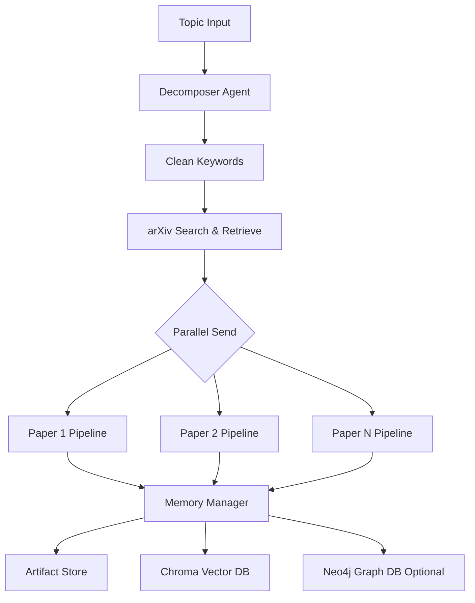
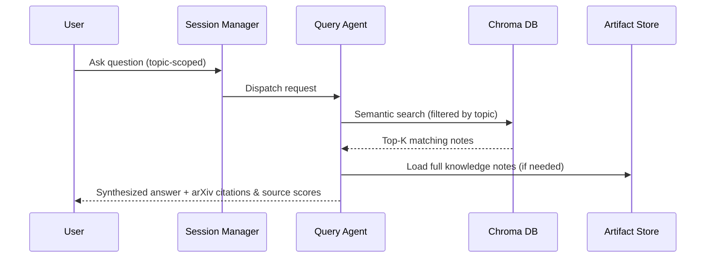

<p align="center">
  
</p>

# Helix Research 🧬

<p align="center">
  <b>Autonomous multi-agent research memory system that turns complex topics into a structured, queryable knowledge base.</b>
</p>

<p align="center">
  <a href="https://github.com/langchain-ai/langgraph"></a>
  <a href="https://github.com/chroma-core/chroma"></a>
  <a href="https://neo4j.com"></a>
  <a href="https://ollama.com"></a>
</p>

Helix Research is a production-grade research engineering assistant. When given a complex research topic, it autonomously decomposes the concept, retrieves academic literature, parallelizes paper digestion (from raw PDF extraction to structured summaries and critical notes), and establishes a session-scoped hybrid memory. Users can then chat directly with their personalized repository of grounded knowledge.

---

## Key Features

<table>
  <tr>
    <td width="30%"><b>Topic-Scoped Sessions</b></td>
    <td>Every research endeavor runs in an isolated workspace. Conversations, documents, and indexing are fully scoped to the active topic.</td>
  </tr>
  <tr>
    <td><b>Autonomous Ingestion</b></td>
    <td>A LangGraph ingestion pipeline that automatically decomposes your research query into optimized search terms and pulls targeted publications from arXiv.</td>
  </tr>
  <tr>
    <td><b>Parallel Per-Paper Pipelines</b></td>
    <td>Leverages LangGraph's <code>Send()</code> interface for true concurrency. Downloaded PDFs are processed in parallel: text extraction, structured summaries, and senior-engineer critical evaluations.</td>
  </tr>
  <tr>
    <td><b>Hybrid Memory Storage</b></td>
    <td>Maintains a local file-based Artifact Store as the source of truth, an indexed Chroma Vector database for topic-filtered semantic retrieval, and an optional Neo4j Graph DB mapping connections between concepts, papers, and authors.</td>
  </tr>
  <tr>
    <td><b>Grounded RAG Chat</b></td>
    <td>Talk to your papers with confidence. The query agent uses retrieved structured summaries to provide exact answers complete with source scores and arXiv citations.</td>
  </tr>
  <tr>
    <td><b>Continuous Monitoring</b></td>
    <td>A background monitor agent automatically polls arXiv at specified intervals to find, ingest, and index new papers related to your active topics.</td>
  </tr>
</table>

---

## System Architecture

### 1. High-Level Ingestion Flow
Helix Research processes a research topic through a multi-agent ingestion graph that runs paper ingestion tasks concurrently:



Each concurrent paper pipeline performs the following steps:
1. **PDF Extractor**: Downloads and parses raw PDF layout structures.
2. **Summarizer**: Builds a dense, structured outline containing objectives, benchmarks, and limitations.
3. **Critic Note**: Generates a finalized Senior-Engineer Knowledge Note detailing contributions, criticality, and metadata.

### 2. Query / RAG Flow
When you ask a question within a session, the system runs the following process:



---

## Project Structure

```
Helix_Research/
├── app.py                      # Streamlit dashboard interface
├── chat.py                      # Session-scoped interactive CLI UI
├── monitor.py                   # Background monitor daemon for new papers
├── pyproject.toml               # Project setup and dependencies
├── requirements.txt             # Pip dependency list
├── .env                         # Local environment settings
├── helix_research.png           # Banner image
│
├── src/
│   ├── agents/
│   │   ├── decomposer.py        # Generates search queries
│   │   ├── pdf_extractor.py     # Handles PDF ingestion
│   │   ├── summarizer.py        # Generates structured summaries
│   │   ├── critic_note.py       # Writes critical knowledge notes
│   │   ├── memory_manager.py    # Orchestrates database & file storage
│   │   ├── query_agent.py       # RAG answering logic
│   │   ├── session_manager.py   # Handles workspace & session states
│   │   └── monitor_agent.py     # Automated polling agent
│   │
│   ├── graphs/
│   │   ├── ingestion_graph.py   # LangGraph ingestion pipeline
│   │   └── query_graph.py       # LangGraph query processing
│   │
│   ├── tools/
│   │   ├── arxiv_tool.py        # Connects to arXiv API
│   │   ├── pdf_tools.py         # PyMuPDF/LlamaParse extractors
│   │   ├── retriever.py         # Retrieval helper classes
│   │   └── research_index.py    # Global tracking and deduplication
│   │
│   ├── db/
│   │   ├── chroma_client.py     # Vector database connection
│   │   └── neo4j_client.py      # Knowledge graph database client
│   │
│   ├── storage/
│   │   └── artifact_store.py    # File-based artifact read/write
│   │
│   ├── models/
│   │   ├── schemas.py           # Structured schema validation models
│   │   └── session.py           # Session configuration schemas
│   │
│   ├── observability/
│   │   ├── startup.py           # Initialize LangSmith traces
│   │   └── tracing.py           # Custom decorators for tracing
│   │
│   └── config.py                # Pydantic central settings
│
├── papers/                      # Source of Truth: PDFs + Structured JSONs
│   └── {arxiv_id}/
│       ├── paper.pdf
│       ├── metadata.json
│       ├── summary.json
│       └── knowledge_note.json
│
├── sessions/                    # Session JSON files
│   └── {session_id}.json
│
└── chroma_db/                   # Local Chroma DB storage
```

---

## Installation & Setup

### 1. Prerequisites
* **Python**: Version `3.11` or higher.
* **uv**: Recommended for fast package management (or use `pip`).
* **Ollama**: Running locally with required models:
  ```bash
  ollama pull qwen2.5:7b
  ```
* **Neo4j** *(Optional)*: Required only if knowledge graph features are enabled.

### 2. Setup environment
Clone the repository and install it in editable mode:
```bash
# Clone the repository
cd Research_Agent

# Create and activate virtual environment
uv venv
source .venv/Scripts/activate # Windows
# source .venv/bin/activate   # Linux/macOS

# Install package dependencies
uv pip install -e .
```

Create and configure your `.env` file:
```bash
cp .env.example .env
```
Edit the `.env` settings:
```env
OLLAMA_BASE_URL=http://localhost:11434
DEFAULT_MODEL=qwen2.5:7b
EXTRACTION_MODEL=qwen2.5:7b
CRITIC_MODEL=qwen2.5:7b

CHROMA_PERSIST_DIR=./chroma_db
# Neo4j configuration (optional)
NEO4J_URI=bolt://localhost:7687
NEO4J_USER=neo4j
NEO4J_PASSWORD=password
```

---

## Usage

### 1. Interactive CLI Chat
Launch the session-scoped terminal interface to create or resume research workspaces:
```bash
PYTHONPATH=. python chat.py
```
You can also launch a topic workspace or resume a session directly:
```bash
# Create or open a topic session
PYTHONPATH=. python chat.py --topic "agents memory architectures"

# Resume session by ID
PYTHONPATH=. python chat.py --session d0ab5049
```
**Interactive CLI commands**:
* `/papers`: Lists all academic papers currently ingested in this workspace.
* `/history`: Shows recent conversation history.
* `/ingest`: Triggers manual re-ingest of papers for the session.
* `/exit`: Saves progress and closes the session.

### 2. Streamlit Dashboard
To run the visual UI and chat dashboard:
```bash
streamlit run app.py
```
This launches a browser window (default: `http://localhost:8501`) where you can create new topics, run continuous monitors, view structured summary tabs, and chat with your repository.

### 3. Background Continuous Monitor
To search for new literature related to your active topics in the background:
```bash
PYTHONPATH=. python monitor.py
```

---

## Observability & Evaluation

### LangSmith Tracing
Helix Research is fully instrumented for tracking and observability. Every LLM generation call, prompt template structure, and graph execution state is traced automatically when standard LangSmith variables are set in your environment:
```env
LANGCHAIN_TRACING_V2=true
LANGCHAIN_ENDPOINT="https://api.smith.langchain.com"
LANGCHAIN_API_KEY="your-langsmith-api-key"
LANGCHAIN_PROJECT="helix-research"
```

### Evaluation Framework
Under `src/evaluation/`, the system includes automated assessment scripts using LLM-as-a-judge patterns to evaluate:
* Ingested note quality (completeness, density, and specificity).
* Retrieval faithfulness and semantic relevance.
* RAG answering correctness.

---

## Design Principles
1. **Artifact Store is the Source of Truth**: Databases (Chroma, Neo4j) are treated as query indexes. All critical data lives as standard JSON files and PDFs in the `papers/` folder and can be re-indexed at any time.
2. **Session-Scoped Isolation**: Documents and histories are strictly bound to their respective topics to minimize context contamination.
3. **True Parallel Processing**: All downloads and paper analyses scale concurrently using graph orchestration.
4. **Polite Web Ingestion**: Employs rate-limiting, retries, and backoffs when querying search endpoints (like arXiv) to ensure reliable runs.
